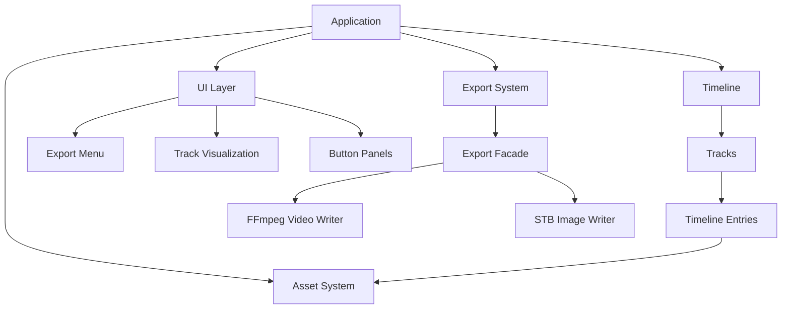
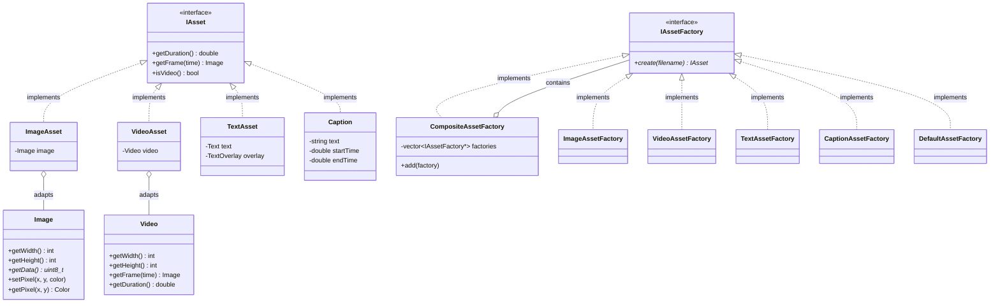
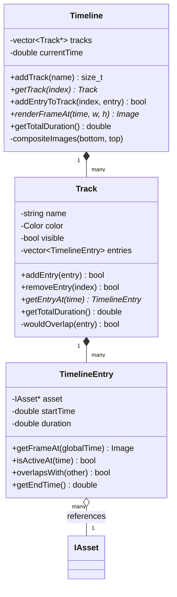
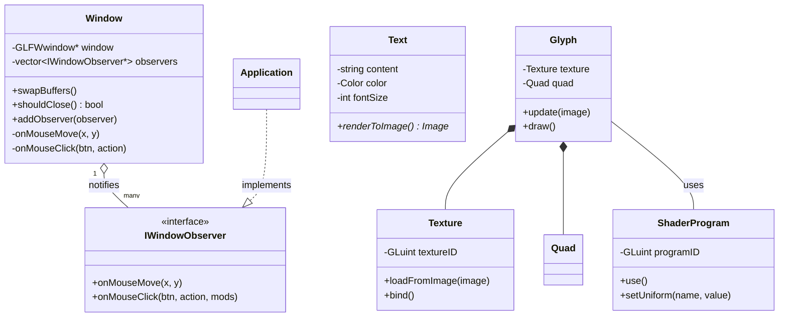
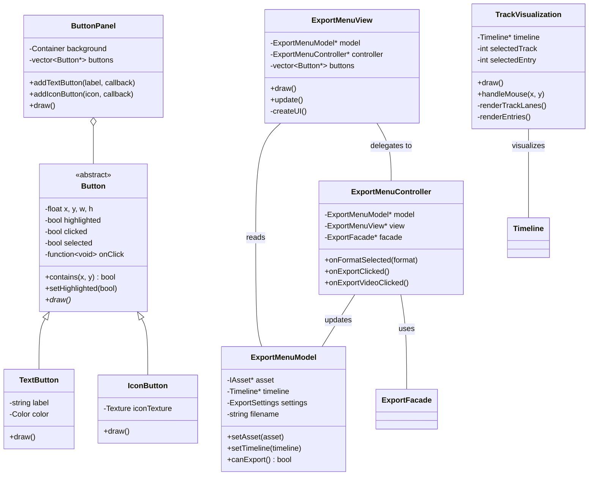
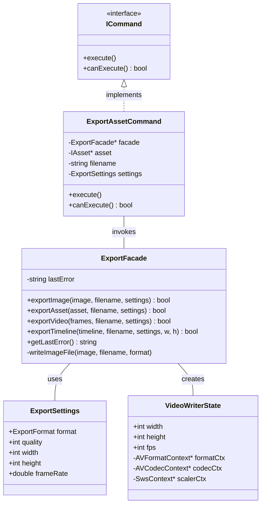

# VideoEditor - Multi-Track Video Editing Application
Group Members: Shane McCue, Idiris Muumin, Manvel Iskandaryan, Noah Turnquist

A C++ video editing application with timeline-based composition, multiple tracks, filters, captions, and export capabilities built using modern design patterns.

## Table of Contents
- [Architecture Overview](#architecture-overview)
- [Assets System](#assets-system)
- [Timeline & Tracks](#timeline--tracks)
- [Graphics & Rendering](#graphics--rendering)
- [UI Components](#ui-components)
- [Export System](#export-system)
- [Filters](#filters)
- [Build Instructions](#build-instructions)

---

## Architecture Overview



---

## Assets System

The asset system provides a flexible framework for loading and adapting different media types into a common interface using the **Adapter** and **Abstract Factory** patterns.



### Core Classes

#### `IAsset` (Interface)
**Pattern**: Target interface for Adapter pattern
**Functionality**: Defines common interface for all media types with `getDuration()` and `getFrame(time)` methods. Enables polymorphic handling of images, videos, text, and captions.

#### `Image` & `Video`
**Pattern**: Adaptee classes
**Functionality**: Core media classes wrapping STB image library and FFmpeg video decoder respectively. Provide raw pixel data access and manipulation.

#### `ImageAsset` & `VideoAsset`
**Pattern**: Adapter pattern
**Functionality**: Adapt `Image` and `Video` to `IAsset` interface. `ImageAsset` returns same frame for any time, `VideoAsset` seeks to requested timestamp.

#### `TextAsset` & `Caption`
**Pattern**: Adapter pattern
**Functionality**: Render text overlays and time-based captions. `TextAsset` generates dynamic text graphics, `Caption` displays text within specified time ranges.

#### `IAssetFactory` (Interface)
**Pattern**: Abstract Factory pattern
**Functionality**: Factory interface with `create(filename)` method. Returns `IAsset*` or `nullptr` if format unsupported. Enables extensible asset loading.

#### `CompositeAssetFactory`
**Pattern**: Composite pattern + Chain of Responsibility
**Functionality**: Contains multiple factories and tries each sequentially until asset is created. Enables adding new asset types without modifying existing code.

#### `DefaultAssetFactory`
**Pattern**: Factory pattern + Null Object pattern
**Functionality**: Fallback factory that always succeeds, creating colored rectangles for unrecognized files. Prevents null pointer exceptions.

---

## Timeline & Tracks

The timeline system enables multi-track video composition with frame-accurate control.



### Core Classes

#### `Timeline`
**Pattern**: Composite pattern + Strategy pattern
**Functionality**: Manages multiple tracks and composites them into final output. Renders frames by iterating tracks bottom-to-top with alpha blending.

#### `Track`
**Pattern**: Collection with validation
**Functionality**: Represents single layer containing non-overlapping timeline entries. Enforces temporal constraints preventing entry overlap on same track.

#### `TimelineEntry`
**Pattern**: Proxy pattern
**Functionality**: Binds asset to track with timing metadata (start, duration). Converts global timeline time to asset-local time for frame retrieval.

---

## Graphics & Rendering

OpenGL-based rendering system with shader support.



### Core Classes

#### `Window`
**Pattern**: Observer pattern (Subject)
**Functionality**: GLFW window wrapper that notifies observers of mouse events. Manages OpenGL context and event polling.

#### `Glyph`
**Pattern**: Facade pattern
**Functionality**: Simplifies rendering by combining texture and geometry. Provides high-level `update(image)` and `draw()` interface abstracting OpenGL calls.

#### `Texture`
**Pattern**: Wrapper pattern
**Functionality**: Manages OpenGL texture lifecycle. Uploads image data to GPU and provides binding interface for rendering.

#### `Text`
**Pattern**: Builder pattern
**Functionality**: Renders TrueType fonts to images using FreeType library. Supports color, size, and anti-aliasing customization.

#### `ShaderProgram`
**Pattern**: Wrapper pattern
**Functionality**: Compiles and links GLSL vertex/fragment shaders. Provides type-safe uniform variable setting for shader parameters.

---

## UI Components

Model-View-Controller architecture for user interface.



### Core Classes

#### `Button` (Abstract)
**Pattern**: Template Method pattern + Command pattern
**Functionality**: Base class defining button interface with state management (highlighted, clicked, selected). Stores callback function executed on click.

#### `ButtonPanel`
**Pattern**: Composite pattern
**Functionality**: Container managing multiple buttons with automatic layout. Provides factory methods for creating text and icon buttons.

#### Export Menu (MVC)
**Pattern**: Model-View-Controller
**Functionality**: Separates export UI into model (settings/state), view (rendering), and controller (event handling). Enables testing and modification without coupling.

#### `TrackVisualization`
**Pattern**: Observer pattern + Visualization
**Functionality**: Renders timeline tracks as interactive lanes. Supports drag-and-drop for reordering, resizing entries, and visual feedback for selections.

---

## Export System

Facade pattern for multi-format export with FFmpeg integration.



### Core Classes

#### `ExportFacade`
**Pattern**: Facade pattern
**Functionality**: Simplifies complex export operations behind unified interface. Supports PNG, JPEG, BMP (via STB) and MP4 (via FFmpeg) formats.

#### `ExportAssetCommand`
**Pattern**: Command pattern
**Functionality**: Encapsulates export operation as object. Enables undo/redo capability, queuing, and validation before execution.

#### `VideoWriterState`
**Pattern**: Wrapper pattern + State pattern
**Functionality**: Wraps FFmpeg H.264 encoder with simple C++ interface. Handles RGBA→YUV420P conversion, frame encoding, and MP4 container writing.

---

## Filters

(Not yet implemented - reserved for future enhancements like color correction, blur, transforms)

---

## Build Instructions

### Prerequisites
- CMake 3.3+
- C++11 compiler (g++, clang++)
- OpenGL 4.3+
- GLFW3
- FreeType2
- FFmpeg (libavcodec, libavformat, libswscale)

### Build Steps

#### 1. Configure with CMake
```bash
mkdir build
cmake -S . -B build
```

#### 2. Compile
```bash
cmake --build build
```
Or:
```bash
cd build
make -j4
```

#### 3. Run
```bash
./build/VideoEditor assets/images/img_small.jpeg assets/videos/test.mp4
```

### Testing
```bash
cd build
./VideoEditorTests
```

---

## Project Structure

```
├── include/           # Header files
│   ├── assets/       # Asset system interfaces and adapters
│   ├── export/       # Export facade and commands
│   ├── filters/      # Filter system (future)
│   ├── graphics/     # OpenGL rendering primitives
│   ├── timeline/     # Timeline, Track, TimelineEntry
│   ├── ui/           # UI components and MVC
│   └── commands/     # Command pattern implementations
├── src/              # Implementation files (mirrors include/)
├── lib/              # Third-party libraries
│   ├── ffmpeg/       # FFmpeg CMake configuration
│   ├── video_reader  # FFmpeg video decoder
│   └── video_writer  # FFmpeg video encoder
├── tests/            # GTest unit tests
└── assets/           # Sample media files
    ├── images/
    ├── videos/
    └── icons/
```

---

## Design Patterns Summary

| Pattern | Usage | Location |
|---------|-------|----------|
| **Adapter** | Image/Video → IAsset | `assets/ImageAsset`, `assets/VideoAsset` |
| **Abstract Factory** | Asset creation from files | `assets/*Factory` |
| **Composite** | Multiple factories | `assets/CompositeAssetFactory` |
| **Facade** | Export simplification | `export/ExportFacade` |
| **Command** | Export operations | `commands/ExportAssetCommand` |
| **MVC** | Export UI separation | `ui/export/ExportMenu*` |
| **Observer** | Window event notifications | `graphics/Window`, `Application` |
| **Template Method** | Button base class | `ui/Button` |
| **Strategy** | Timeline compositing | `timeline/Timeline` |

---

# team-41-hw3
# ISKAN016
